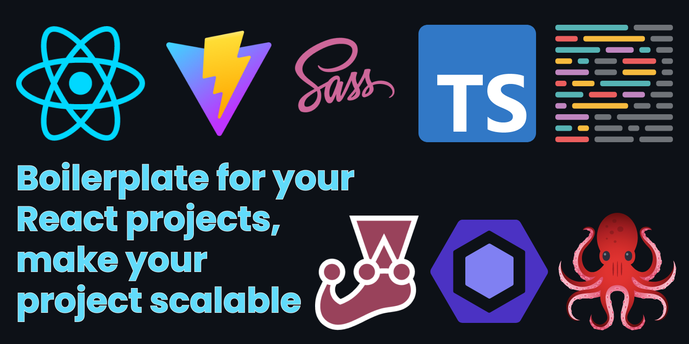

# React Project Setup

It is very common that when you start a new project, you want to implement best practices, keep your code clean and generate a scalable development, this repository shows recommendations on how to achieve something like that.

This repository is the result of my Medium article: [Arquitectura escalable para proyectos de React](https://baguilar6174.medium.com/arquitectura-escalable-para-proyectos-de-react-ce8520071ca4)

<table>
  <tr>
    <td align="center" valign="center"></td>
  </tr>
</table>

# Dev features

- Vite
- Typescript
- ESLint
- Prettier
- SCSS
- Commit standar with Commitlint
- Husky (precommit and prepush)
- Use .nvmrc and .npmrc files
- Alias paths
- Testing (Jest & React Testing Library)

# Other considerations

- Environment variables
- Atomic design
- Redux
- Routing using lazy loading
- Use axios (implement interceptor)
- Storybook

## Stay in touch

- Website - [www.bryan-aguilar.com](https://www.bryan-aguilar.com/)
- Medium - [baguilar6174](https://baguilar6174.medium.com/)
- LinkeIn - [baguilar6174](https://www.linkedin.com/in/baguilar6174)
